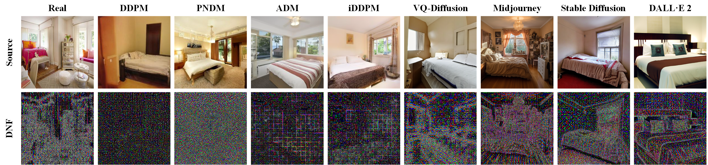

Hello, I am **Yichi Zhang** 张亦弛, an undergraduate student majoring in **Information Engineering** at the College of Information Science and Electronic Engineering, Zhejiang University. I am also minoring in **Computer Science and Technology** at the College of Computer Science and Technology, Zhejiang University.  

<!-- 我的研究兴趣包括机器学习，以及人工智能系统中的隐私与安全。在过去的半年中，我致力于检测由高质量图像生成器生成的图像，保证人们免受虚假信息的危害。现如今，我全身心投入于机器学习中的后门攻击及其检测的研究中，尝试寻找一种足够鲁棒的攻击范式以及一种足够泛化的检测/攻击无害化手段来从数据投毒式后门攻击中保护模型。

我一直在寻找志同道合的伙伴与我合作，欢迎随时联系我。 -->

My research interests include **Machine Learning**, as well as **Privacy and Security** in artificial intelligence systems. Over the past six months, I have been dedicated to detecting images generated by high-quality image generators to ensure people are protected from misinformation. Currently, I am fully immersed in researching backdoor attacks in machine learning and their detection, attempting to find a robust attack paradigm and a sufficiently generalizable means of detecting/neutralizing attacks to protect models from data poisoning backdoor attacks.

I have been seeking like-minded partners to collaborate with and welcome any outreach at your convenience.

Publications/Manuscripts
======
**Diffusion Noise Feature: Accurate and Fast Generated Image Detection**[[paper](https://arxiv.org/abs/2312.02625)]/[[code](https://github.com/YichiCS/Diffusion-Noise-Feature-Accurate-and-Fast-Generated-Image-Detection)]  
**Yichi Zhang**, Xiaogang Xu

